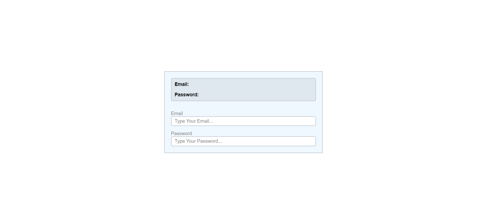
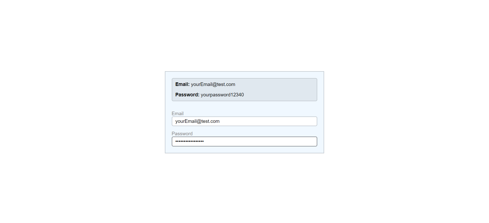
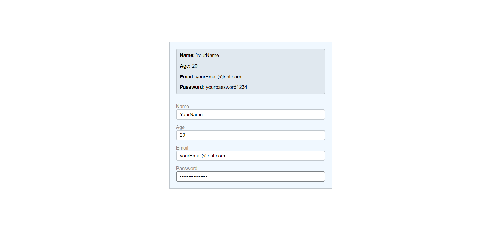

# Simple Redux State Management and Input Form Example

This is a simple example of a React application that demonstrates Redux state management with a dynamic number of input fields. Each input field is associated with a Redux state, and they are created based on an array of states.

## Overview

The application consists of a single page that displays a list of states stored in Redux. Below the list, there is a form with input fields that correspond to each state. When you type in an input field and press Enter or move the focus away from the input, the Redux state is updated using the `dispatch` method.

## Installation

To run this application locally, follow these steps:

1. Clone the repository:

   ```bash
   git clone https://github.com/Cristianjs93/redux
   ```

2. Change to the project directory:

   ```bash
   cd redux
   ```

3. Install the dependencies:

   ```bash
   npm install
   ```

4. Start the development server:

   ```bash
   npm run dev
   ```

## Usage

Once the application is running, open it in your web browser (usually at http://localhost:5173/). You will see a screen with the list of states and an input form. To interact with the application, follow these steps:

1. Observe the list of states displayed on the screen. Below the list, you'll find an input form. Each input field corresponds to a state.
   <br/>

   

2. Type a new value into one of the input fields and observe how the Redux state is updated with the new value.
   <br/>

   

3. Repeat the process for other input fields as needed.

## Customization

To customize the number of states and input fields, modify the `inputs` array in the `inputs.js` file. Each element in the array corresponds to a state and an input field. You can dynamically control the number of states and inputs by adding or removing elements from the array.
<br/>



**¡Reach Further!** 🚀
